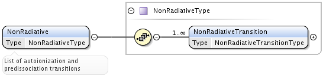

.. _NonRadiative:

Processes.NonRadiative
=========================

Describes typical processes of a spontanous decay without photons, for
instance, autoionization or predissociation.

**NonRadiative** element is a container for a list of **NonRadiativeTransition** elements

.. _NonRadiativeTransition:

NonRadiativeTransition
---------------------------

	.. image:: images/nonradiative/NonRadiativeTransition.png
	
	**NonRadiativeTransition** element is defined in **NonRadiativeTransitionType** as
	the extension of the :ref:`PrimaryType`, containing following attributes and elements:
	
	*	mandatory **id** attribute of type :ref:`ProcessIDType`,
	*	optional **groupLabel** attribute of type *String*, used to indicate arbitrary process groups;
	*	optional **process** attribute to specify if *deexcitation* or *excitation* is described;
	*	mandatory **UpperStateRef** :ref:`StateRefType` reference,
	*	optional **LowerStateRef** of the same type,
	*	optional **SpeciesRef** of :ref:`SpeciesRefType`,
	*	optional **Probability** element (type :ref:`DataType`),
	*	optional **TransitionEnergy** of :ref:`DataType`, the energy difference between initial and
		final state.
	*	optional string **Type** element, that may provide additional details (e.g., indicate that this is a
		Coster-Kronig process).

	