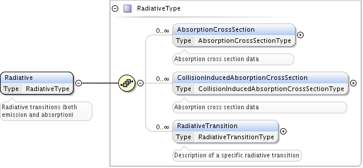

.. _Radiative:

Processes.Radiative
======================

This part of the schema describes radiative processes including spontaneous
radiative decays. Also photoabsorption :ref:`CrossSection` is represented here.
The other way to describe Collisions between photons and various objects (e.g.,
molecules) is in the :ref:`Collisions` part.




.. _RadiativeTransition:

RadiativeTransition
--------------------------

	Extension of the :ref:`PrimaryType`. A transition is characterized by its
	energy/wavelength (element :ref:`EnergyWavelength`) and following optional elements:
	
	*	**InitialStateRef** of type :ref:`StateRefType`, reference to the initial state of the transition,
	*	**FinalStateRef**, reference to the final state of the transition, type :ref:`StateRefType`),
	*	**SpeciesRef** element of type :ref:`SpeciesRefType`, that may be used in place of the previous two
		in case of unknown states. All three references may be specified, in that case states should belong
		to the molecule/atom, indicated by **SpeciesRef**.
	*	list of :ref:`Probability` elements of type **RadiativeTransitionProbabilityType**.
		Different values of probabilities may be due to different multipole orders
		(e.g., M1 and E2 may be possible for the same initial and final states).
	*	multiple :ref:`SatelliteLine` elements,
	*	multiple :ref:`Broadening` elements,
	*	list of :ref:`Shifting`.

	.. image:: images/radiative/RadTrans.png

.. _EnergyWavelength:

EnergyWavelength
-------------------

	Extension of the :ref:`PrimaryType`, may contain multiple **Wavenumber**, **Wavelength**, **Energy** 
	or **Frequency** elements, each of :ref:`DataType`. Exact nature of parameter must be determined through 
	:ref:`Method`, with help of :ref:`PrimaryType`'s method reference. Method's **Category** element takes in this
	case values in (*experiment*, *theory*, *ritz*).

	.. image:: images/radiative/EnergyWavelength.png
	

.. _Probability:

Probability
-------------

	Probability element is defined as the extension of the :ref:`PrimaryType`. 
	Describes parameters, relevant to transition probability.
	Following optional elements are possible, all of :ref:`DataType` if not stated otherwise:
	
	*	**TransitionProbabilityA** - Einstein coefficient, or transition probability.
	*	**OscillatorStrength** - Oscillator strength (dimensionless). Whether it is absorption or emission, is
		determined from the initial and final states of the transition.
	*	**LineStrength** - A symmetric quantity with respect to initial and final states of the
		transition.
	*	**WeightedOscillatorStrength** - Product of the oscillator strength and statistical weight of the **initial**
		state.
	*	**Log10WeightedOscillatorStrength** - :math:`Log_{10}` of the **WeightedOscillatorStrength**.
	*	**IdealisedIntensity** - Line intensity under specific conditions. Due to its dependence on plasma
		parameters, this is not a universal property of a spectral line and thus
		should be used with care.
	*	**Multipole** of type **MultipoleType** - multipole order of a radiative transition (electric or magnetic). 
		It is a string with the first upper-case symbol **E** or **M** followed by one or more digits, 
		and the first digit cannot be **0**.
	*	**EffectiveLandeFactor** - Effective Lande factor, line intensity coefficient for magneto-sensitive atomic lines.

	.. image:: images/radiative/Probability.png
	


.. _SatelliteLine:

SatelliteLine
---------------
	
	**SatelliteLine** element is used to keep properties of atomic optical electron satellite lines:
	
	.. image:: images/radiative/SatelliteLine.png
	
	Multiple **SatelliteLine** elements may be specified, with three optional child elements:
	
	*	DielectronicIntensityFactor
	*	CollisionalIntensityFactor
	*	BranchingRatio
	
	each of :ref:`DataType`.


.. _Broadening:

Broadening
-----------------

	.. image:: images/radiative/Broadening.png
		:alt:	Broadening element
	
	Each broadening element has 
	
	-	**name** attribute, that must contain one of the names from :ref:`lineshape_dictionary`
	
	-	**envRef** attribute, referencing the specific environment conditions, 
		for example, for collisional broadening.
	
	-	one or more :ref:`lineshape` elements, with their respective parameters.
	
	Normally, one broadening record should be created for each broadening mechanism 
	and for each source (data origin).
	Many Lineshape elements allow to represent, for example, 
	processing of the same experimental data with different lineshapes. 
	Usually, there will be only one Lineshape element.
	
.. _lineshape:

Lineshape
```````````````````	
	.. image:: images/radiative/LineShape.png
		:alt:	Lineshape element exploded
	
	**Lineshape** in turn also has 
	
	-	optional **name** attribute from :ref:`lineshape_dictionary`, like Lorentz, Voigt, Doppler, etc.
	
	-	optional **functionRef** attribute of type :ref:`FunctionRefType`, with a reference to a :ref:`Functions`
		describing the lineshape. This attribute should be used only in case when the lineshape 
		used in data fitting is absent in the :ref:`lineshape_dictionary`
	
	-	one or more :ref:`lineshape_parameter`, each representing specific lineshape parameter 
		as either a constant value or a function of environment parameters
	
.. _lineshape_parameter:

LineshapeParameter
```````````````````````
	
	.. image:: images/radiative/LineShapeParameter.png
		:alt:	LineshapeParameter element exploded
	
	**LineshapeParameter**
		either **FitParameters** or **Value**/**Accuracy** pair must be specified
	
	- **name** attribute corresponds to one defined in :ref:`lineshape_dictionary` for specific lineshape
	
	- **Value**/**Accuracy** elements are the same as in :ref:`DataType`,
	
	- **FitParameters**, of type :ref:`FitParametersType`, that allows representation of this parameter as a function of environment parameters, for example::
	
		<Broadening envRef="Eair-broadening-ref-env" name="pressure">
			<Lineshape name="Lorentzian">
				<Comments>The temperature-dependent pressure broadening 
				Lorentzian lineshape</Comments>
				<LineshapeParameter name="gammaL">
					<FitParameters functionRef="FgammaL">
						<FitArgument units="K" name="T">
							<LowerLimit>240</LowerLimit>
							<UpperLimit>350</UpperLimit>
						</FitArgument>
						<FitArgument units="atm" name="p">
							<LowerLimit>0.</LowerLimit>
							<UpperLimit>1.2</UpperLimit>
						</FitArgument>
						<FitParameter name="gammaL_ref">
							<SourceRef>BHIT-B_HITRAN2008</SourceRef>
							<Value units="1/cm">0.0635</Value>
							<Accuracy>0.003175</Accuracy>
						</FitParameter>
						<FitParameter name="n">
							<SourceRef>BHIT-B_HITRAN2008</SourceRef>
							<Value units="unitless">0.75</Value>
							<Accuracy>0.15</Accuracy>
						</FitParameter>
					</FitParameters>
				</LineshapeParameter>
			</Lineshape>
		</Broadening>
	
	Where function FgammaL is defined as follows::
	
		<Function functionID="FgammaL">
			<Comments>This function gives the pressure- and 
			temperature-dependence of the Lorentzian component of the 
			pressure-broadened line width (HWHM)</Comments>
			<Expression computerLanguage="Fortran">
				gammaL_ref * p * (296./T)**n
			</Expression>
			<Y name="gammaL" units="1/cm"/>
			<Arguments>
				<Argument name="T" units="K">
					<Description>The absolute temperature, in K</Description>
				</Argument>
				<Argument name="p" units="atm">
					<Description>The partial pressure of the broadening species,
									in atm</Description>
				</Argument>
			</Arguments>
			<Parameters>
				<Parameter name="gammaL_ref" units="1/cm">
					<Description>The Lorentzian HWHM of the line, broadened at
						Tref = 296 K and broadening species partial pressure
						pref = 1atm</Description>
				</Parameter>
				<Parameter name="n" units="unitless">
					<Description>
						The temperature exponent of the gammaL function
					</Description>
				</Parameter>
			</Parameters>
		</Function>
	

.. _Shifting:

Shifting
-----------------

	.. image:: images/radiative/Shifting.png
		:alt:	Shifting element exploded
		
	Line shifting is defined by **name** and/or **envRef** attributes. 
	In case of linear collisional shifting, only environment is sufficient.
	
	**ShiftingParameter** element is defined the same way as broadening :ref:`lineshape_parameter`, 
	it is either value or function of environment parameters.
	
	Example of a Shifting definition::
	
		<Shifting envRef="Eair-broadening-ref-env">
			<ShiftingParameter name="delta">
				<FitParameters functionRef="Fdelta">
					<FitArgument name="p" units="atm">
						<LowerLimit>0.</LowerLimit>
						<UpperLimit>1.2</UpperLimit>
					</FitArgument>
					<FitParameter name="delta_ref">
						<SourceRef>BHIT-B_HITRAN2008</SourceRef>
						<Value units="unitless">-0.001</Value>
						<Accuracy>0.1</Accuracy>
					</FitParameter>
				</FitParameters>
			</ShiftingParameter>
		</Shifting>
	
	


.. _CrossSection:

CrossSection
-------------------

	Among with **RadiativeTransition** elements, :ref:`Radiative` processes block now has a **CrossSection** element,
	which allows description of
	absorption cross-section data and vibrational bands assignment in case of complex molecules.
	
	
	.. image:: images/radiative/CrossSection.png
		:alt:	RadiativeTransition child elements
		
	-	**Description**, **X** and **Y** elements describe cross-section data in tabular form, 
		where **X** can be absorbed radiation frequency, wavelength or wavenumber in a form of a list of values or sequence.
		**Y** then represents a sequence of sigma values.
	
	- 	**Species** element may have **StateRef** and/or **SpeciesRef** child elements, indicating species or specific states,
		to which crossection data applies.
	
	-	**BandAssignment** allows to indicate specific vibrational modes in cross-section data.
	
	.. image:: images/radiative/BandAssignment.png
		:alt:	CrossSection BandAssignment element
		
		
Example cross-sections record
``````````````````````````````````
	
	*Warning:* **DataList** is truncated for clarity, originally it contains 880 space-separated numbers.
	You may see the original element in schema examples (*tests/valid/azulene-working.xml*).
	
	::

		<CrossSection>
			<SourceRef>B_NIST1</SourceRef>
			
			<Description>The IR transmittance cross section of azulene from the NIST 
			Standard Reference Data Program Collection</Description>
			
			<X parameter="wavenumber" units="1/cm">
				<LinearSequence n="880" units="1/cm" a0="450." a1="4"/>
			</X>
			<Y parameter="sigma" units="arbitrary">
				<DataList n="880">
					0 85 94 .. 102
				</DataList>    
			</Y>
			
			<Species>
				<SpeciesRef>X-CUFNKYGDVFVPHO-UHFFFAOYAT</SpeciesRef>
				<StateRef>SX_Azulene-1</StateRef>
			</Species>
			
			<BandAssignment name="2v1+v2">
				<BandCentre>
					<Value units="1/cm">410</Value>
					<Accuracy>2</Accuracy>
				</BandCentre>
				<BandWidth>
					<Value units="1/cm">40</Value>
					<Accuracy>5</Accuracy>
				</BandWidth>
				<Modes>
					<DeltaV modeID="V1">2</DeltaV>
					<DeltaV modeID="V2">1</DeltaV>
				</Modes>
			</BandAssignment>
			<BandAssignment name="3v4+2v5">
				<BandCentre>
					<Value units="1/cm">1657</Value>
					<Accuracy>10</Accuracy>
				</BandCentre>
				<BandWidth>
					<Value units="1/cm">120</Value>
					<Accuracy>15.5</Accuracy>
				</BandWidth>
				<Modes>
					<DeltaV modeID="V2">3</DeltaV>
					<DeltaV modeID="V3">2</DeltaV>
				</Modes>
			</BandAssignment>
			
		</CrossSection>
		

