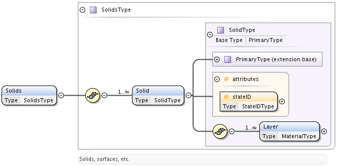

.. _Solids:

Species.Solids
================

The **Solids** branch of XSAMS that describes properties of solids and
surfaces is still in the inital phase of development. However, it was decided
to provide at least such rudimentary description in order to give users and
developers a clear idea of the chosen approach.

The same way as with other **species**, **Solids** element is just a container
for **Solid** elements.

Solid
------------
	Extension of the :ref:`PrimaryType`. Attribute **stateID** is mandatory. Must
	have one or more **Layer** elements of type **MaterialType**.
	
Layer
---------

	The layer is defined here as a *uniform macroscopic* part of a solid.
	It is characterized by the mandatory elements:
	
	*	**MaterialName** (type **xs:string**) and 
	*	:ref:`MaterialComposition` of type **MaterialCompositionType**.
	
	Other optional elements are:
	
	*	**MaterialThickness** of :ref:`DataType`,
	*	string **MaterialTopology**,
	*	**MaterialTemperature** (type :ref:`DataType`),
	*	arbitrary string **Comments**.

	.. image:: images/solids/Layer.png

.. _MaterialComposition:

MaterialComposition
--------------------

	Extension of the :ref:`PrimaryType`, must have one or more of **Component** elements,
	each belonging to the **MaterialComponentType**.

	.. image:: images/solids/Material.png
	
	**Component** element has **ChemicalElement** element (of :ref:`ChemicalElementType`)
	and either **StoichiometricValue** or **Percentage**, both **xs:decimal**.
	All these parameters are mandatory.

	.. image:: images/solids/Component.png
